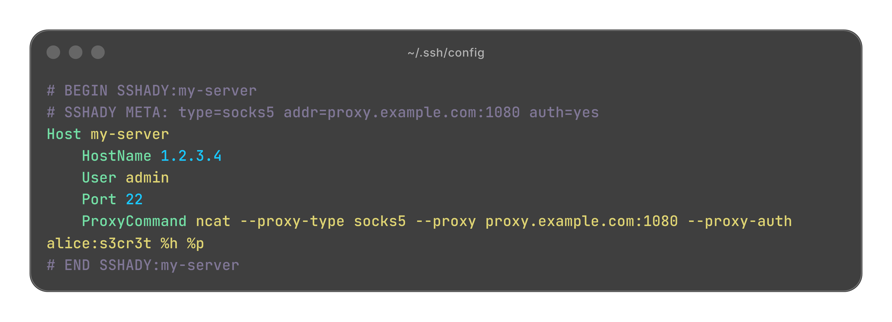

<p align="center">
  
</p>

# sshady

Stop leaking your real IP every time you SSH into a server.

`sshady` generates SSH proxy configs and writes them straight to `~/.ssh/config`. One wizard, one alias, your traffic routes through SOCKS5 / HTTP / Tor / jump host — the target sees the proxy, not you.

Built for opsec-conscious sysadmins, pentesters, and anyone who cares where their packets come from.

[](https://github.com/Miro-sh/sshady/actions/workflows/ci.yml)
[](https://goreportcard.com/report/github.com/Miro-sh/sshady)
[](LICENSE)

---

## Security

> **This tool stores proxy credentials in plaintext inside `~/.ssh/config` (with `0600` permissions).**  
> Read [SECURITY.md](SECURITY.md) for best practices on credential handling.

**All inputs are validated** to prevent command injection and SSH config injection attacks.
See [AUDIT.md](AUDIT.md) for the full security audit.

---

## Prerequisites

- Go 1.21+ (to build from source)
- `ncat` (from the `nmap` package) on the machine you SSH from

```bash
# Debian / Ubuntu
sudo apt install ncat

# Arch Linux
sudo pacman -S nmap

# macOS
brew install nmap
```

---

## Installation

### From source

```bash
git clone https://github.com/Miro-sh/sshady
cd sshady
make build
sudo make install
```

### Using `go install`

```bash
go install github.com/Miro-sh/sshady@latest
```

---

## Quick Start

```bash
# Launch the interactive wizard
sshady

# Or use flags for scripting
sshady create \
  --alias myserver \
  --host 1.2.3.4 \
  --user admin \
  --proxy-type socks5 \
  --proxy-host proxy.example.com \
  --proxy-port 1080

# Connect!
ssh myserver
```

---

## Usage

### Interactive wizard

Run `sshady` with no arguments and answer the prompts:

```bash
sshady
```



### Non-interactive (flags)

Provide `--alias`, `--host`, and `--proxy-type` to skip the wizard entirely:

```bash
# SOCKS5 without auth
sshady create \
  --alias myserver \
  --host 1.2.3.4 \
  --user admin \
  --proxy-type socks5 \
  --proxy-host proxy.example.com \
  --proxy-port 1080

# SOCKS5 with auth (use --proxy-pass-file for security!)
sshady create \
  --alias myserver \
  --host 1.2.3.4 \
  --proxy-type socks5 \
  --proxy-host proxy.example.com \
  --proxy-port 1080 \
  --proxy-user alice \
  --proxy-pass-file ~/.ssh/proxy-pass

# Or via environment variable (most secure)
SSHADY_PROXY_PASS=s3cr3t sshady create \
  --alias myserver \
  --host 1.2.3.4 \
  --proxy-type socks5 \
  --proxy-host proxy.example.com \
  --proxy-user alice

# HTTP CONNECT proxy
sshady create \
  --alias myserver \
  --host 1.2.3.4 \
  --proxy-type http \
  --proxy-host proxy.example.com \
  --proxy-port 8080

# Tor (no proxy address needed, auto-fills 127.0.0.1:9050)
sshady create --alias hidden --host 1.2.3.4 --proxy-type tor

# SSH jump host / bastion
sshady create \
  --alias internal \
  --host 10.0.0.5 \
  --proxy-type jump \
  --jump-host bastion@192.168.1.1
```

---

## Commands

| Command | Description |
|---------|-------------|
| `sshady` | Launch the interactive wizard |
| `sshady create` | Create a new proxy configuration |
| `sshady create [flags]` | Non-interactive mode |
| `sshady list` | List all entries managed by sshady |
| `sshady delete <alias>` | Remove a managed entry |
| `sshady --version` | Show version |
| `sshady --help` | Show help |

### Global Flags

| Flag | Description |
|------|-------------|
| `--dry-run` | Show what would be written without modifying `~/.ssh/config` |

### Create Flags

| Flag | Description | Default |
|------|-------------|---------|
| `--alias` | SSH host alias | required |
| `--host` | Target hostname or IP | required |
| `--user` | SSH user | current user |
| `--port` | SSH port | `22` |
| `--identity-file` | Path to SSH private key | none |
| `--proxy-type` | `socks5`, `http`, `tor`, or `jump` | required |
| `--proxy-host` | Proxy hostname or IP | required for socks5/http |
| `--proxy-port` | Proxy port | `1080` |
| `--proxy-user` | Proxy username | none |
| `--proxy-pass` | Proxy password (**WARNING: visible in ps**) | none |
| `--proxy-pass-file` | Read proxy password from file (**recommended**) | none |
| `--jump-host` | Jump host (`user@host`) | required for jump |

---

## Supported proxy types

| Type | Description | Requirement |
|------|-------------|-------------|
| `socks5` | SOCKS5 proxy, optional user/pass auth | `ncat` |
| `http` | HTTP CONNECT proxy, optional user/pass auth | `ncat` |
| `tor` | Routes through Tor, auto-fills `127.0.0.1:9050` | `ncat` + Tor running |
| `jump` | SSH jump host / bastion server | SSH only, no `ncat` needed |

---

## What gets written to ~/.ssh/config

Each entry is wrapped in marker comments so `sshady list` can track what it manages:

```
# BEGIN SSHADY:myserver
# SSHADY META: type=socks5 addr=proxy.example.com:1080 auth=no
Host myserver
    HostName 1.2.3.4
    User admin
    Port 22
    ProxyCommand ncat --proxy-type socks5 --proxy proxy.example.com:1080 %h %p
# END SSHADY:myserver
```

Then connect normally:

```bash
ssh myserver
```

---

## Security notes

- A backup is created at `~/.ssh/config.sshady.bak` before every write.
- All writes are atomic (temp file + rename, no partial writes).
- `~/.ssh/config` is always written with `0600` permissions.
- All user inputs are validated against strict patterns to prevent injection attacks.
- If you use proxy authentication, credentials are stored in plaintext inside `~/.ssh/config`. Keep that file private and never commit it.
- Prefer `--proxy-pass-file` or `SSHADY_PROXY_PASS` env var over `--proxy-pass` to avoid exposing credentials in the process list.

Read the full [Security Policy](SECURITY.md) and [Audit Report](AUDIT.md).

---

## Development

See [CONTRIBUTING.md](CONTRIBUTING.md) for development setup and contribution guidelines.

```bash
make build    # Build
make test     # Run tests with race detector
make lint     # Run golangci-lint
```

---

## License

MIT — see [LICENSE](LICENSE).
